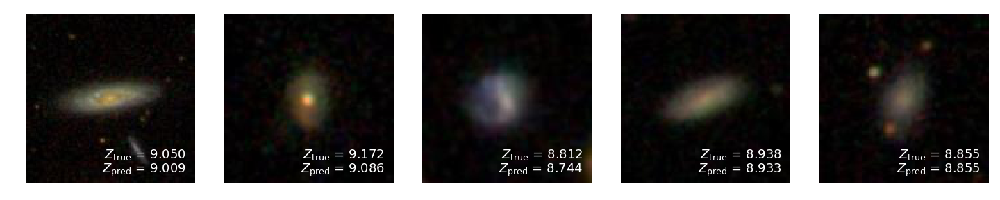

# Galaxy-CNNs
## Using three-band SDSS imaging to predict gas-phase metallicity



We use convolutional neural networks (CNNs or convnets) to predict 
galaxy properties using Sloan Digital Sky Survey (SDSS) *gri* images.
Gas-phase metallicity, which is often estimated by using optical
spectroscopy, can also be estimated using our CNN.

We describe our methods in a paper: [Wu & Boada (2018)](https://arxiv.org/abs/1810.12913).

## Table of contents
- [Usage](#usage)
  * [Dependencies](#dependencies)
  * [Data sets](#data-sets)
  * [Training and testing](#training-and-testing)
- [Citation](#citation)


## Usage
Download this repository by running
```
git clone https://github.com/jwuphysics/galaxy-cnns.git
cd galaxy-cnns
```

### Dependencies
All analysis was performed inside the Jupyter notebooks using a Python3 environment.
We use the verion 0.7.0 of the [fastai](https://github.com/fastai/fastai) machine 
learning framework built atop [Pytorch](https://pytorch.org/). This can be installed 
by running the following:
```
git clone https://github.com/fastai/fastai.git
cd fastai 
conda env create -f environment.yml
```

Note that you will need a GPU. If you don't have one, substitute the previous last line
with this instead:
```
conda env create -f environment-cpu.yml
```

Before executing any code (or running any notebooks), enter the environment
by running `conda activate fastai` (or `conda activate fastai-cpu`).

If you encounter any errors, please feel free to reach out to me (@jwuphysics)
or check [this post](https://forums.fast.ai/t/fastai-v0-7-install-issues-thread/24652) 
on the fastai forums.


### Data sets
We queried the [SDSS DR14 image cutout service](http://skyserver.sdss.org/dr14/en/help/docs/api.aspx#imgcutout) 
using the script `./download_images.py` in order to obtain *gri* images.

We queried the [SDSS MPA-JHU DR7 catalog](https://wwwmpa.mpa-garching.mpg.de/SDSS/DR7/)
of spectral line and derived galaxy properties using the commands in the `SQL` script,
`./SDSS_sql_query.sql`.

### Training and testing

To run the our notebooks, make sure that you are in the `fastai` conda environment first, 
and then run `jupyter notebook` and enter the `./notebook` directory.

If you wish to reproduce all figures from the paper, run the notebooks in the 
`./notebook/paper` directory. You will first need to have downloaded all of the
data and executed the notebooks labeled 
"06. Predicting stellar mass in addition to metallicity.ipynb" and 
"10. The effects of resolution.ipynb" first (sorry about this disorganization -- this
may be cleaned up in a future update).


## Citation
If you would like to reference our [paper]((https://arxiv.org/abs/1810.12913)), 
please use the following citation, produced by 
[NASA ADS](http://adsabs.harvard.edu/cgi-bin/bib_query?arXiv:1810.12913):
```
@ARTICLE{2018arXiv181012913W,
   author = {Wu, J.~F. and Boada, S.},
    title = "{Using convolutional neural networks to predict galaxy metallicity from three-color images}",
  journal = {ArXiv e-prints},
archivePrefix = "arXiv",
   eprint = {1810.12913},
 keywords = {Astrophysics - Astrophysics of Galaxies},
     year = {2018},
    month = {oct}
}
```
